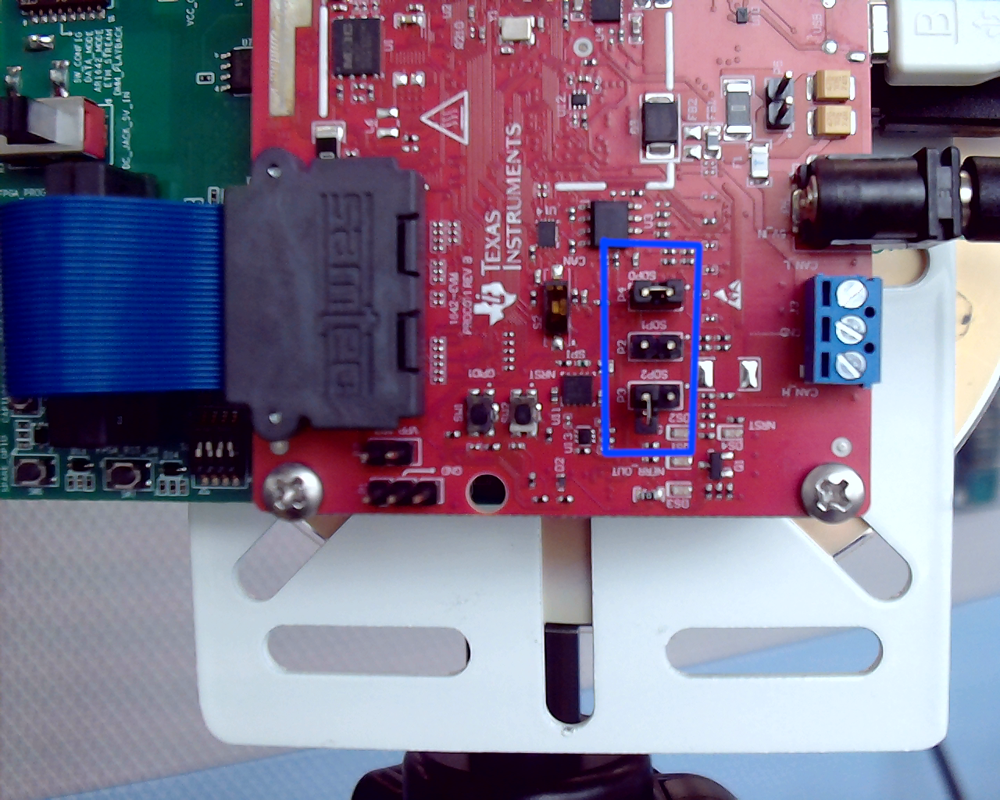
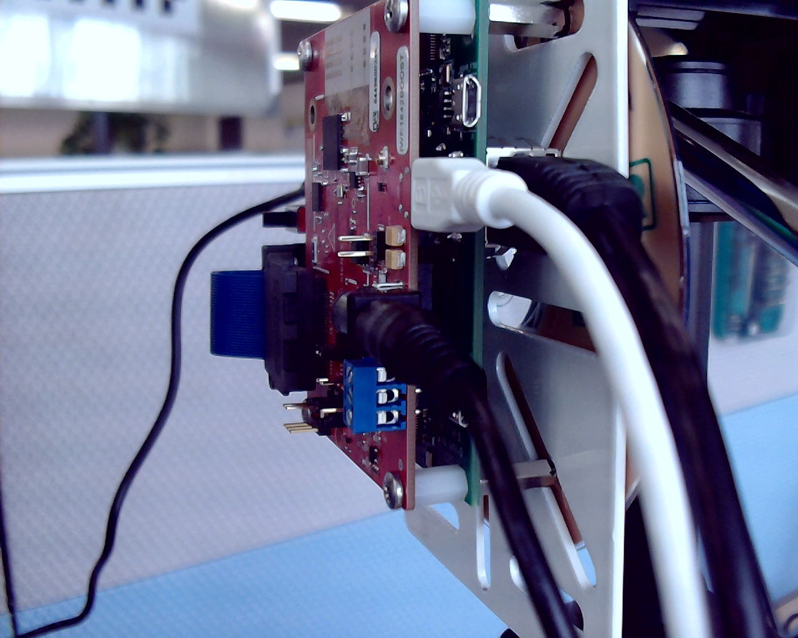
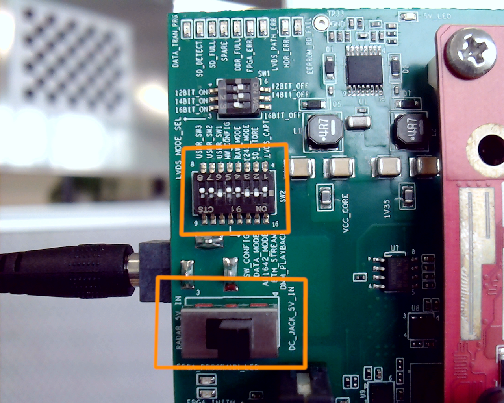
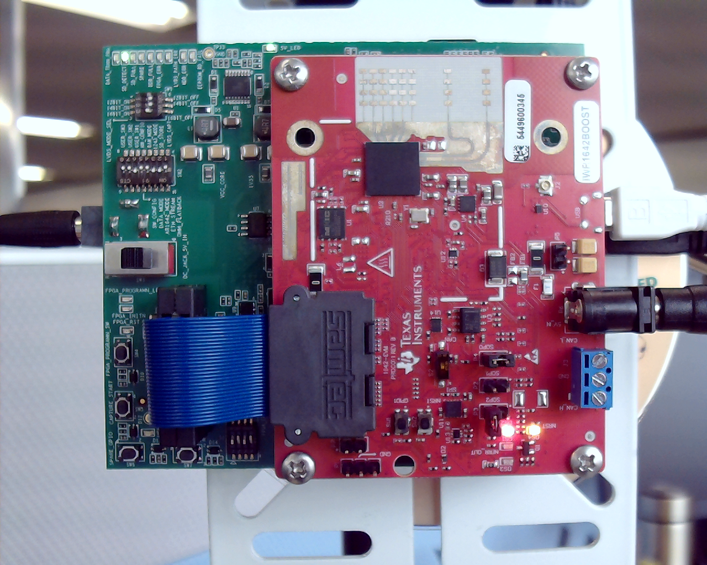
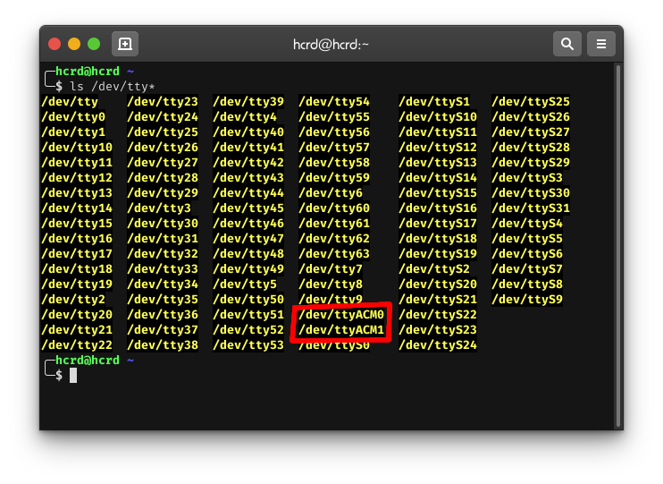
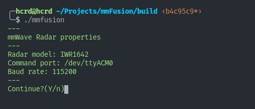
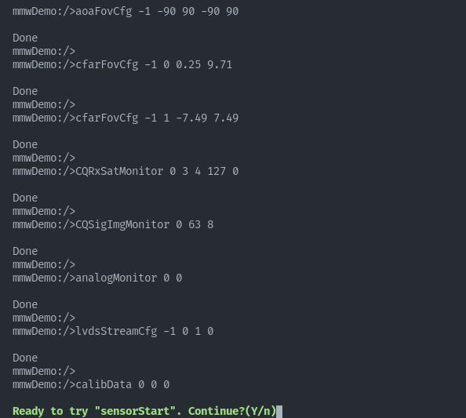
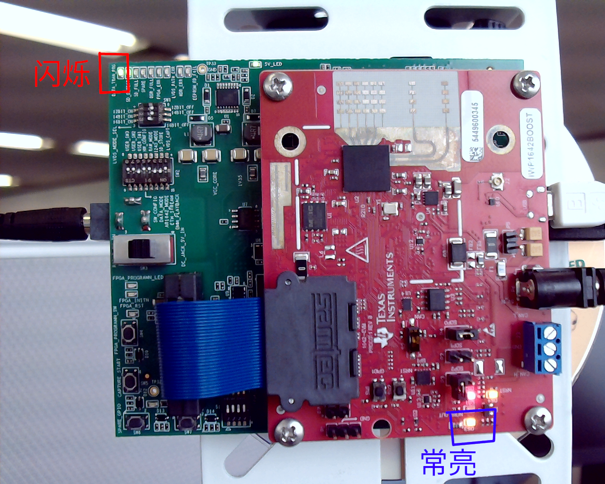

# 毫米波雷达Demo使用说明

## 1. 硬件的配置和连接

### 1.1 材料准备

所需硬件设备如下：

* 雷达开发板及数据采集卡
* 直流电源两个（输出不低于 5V 2A）
* USB 线缆一根
* CAT.5E 或以上网线一根（建议 CAT6 ）
* 计算机一台

### 1.2 配置 IWR1642

按照下表配置 IWR1642 上的跳线：（下图蓝框内）

| 跳线 | 状态 |
| :--: | ---- |
| SOP0 | 闭合 |
| SOP1 | 断开 |
| SOP2 | 断开 |



然后连接 USB，电源和网线：



### 1.3 配置数据采集卡

按照下图所示，配置数据采集卡上的 SW2 拨动开关。连接电源，并将 SW3 开关拨到 DC_JACK_5V_IN 一侧。



最后，上电并稍等片刻，正常情况下能看到下图所示的状态：



### 1.4 计算机的配置

将采集卡的网线接到计算机（或路由器）的**千兆网口**上，将开发板上的 USB 接到计算机。打开终端，输入：

```bash
ls /dev/tty*
```

如果输出中含有 /dev/ttyACM*，表明设备能够被成功识别到。



最后修改网络配置，打开系统设置页面下的网络设置，根据下图修改（这里以有线连接为例）：


## 2. 演示程序参数的设置

程序的配置文件在工程目录下的 config 文件夹中。其中 system.xml 是主配置文件，xxxx_profile.cfg 是毫米波雷达的配置文件。


打开 system.xml，与演示程序有关的参数均在 mmWave 字段之内。


这里主要注意的是 DCA1000 这个部分，其中：ip 字段要填入数据采集卡的 IP 地址，一般情况下采用出厂设定的默认值（如上图所示），cmdPort 和 dataPort 一般情况下也要确保与上图一致（均为出厂设定值）。triggerMode 和 cfgPath 两个字段目前没有启用，保持与图上一致即可。

大多数情况下，system.xml 这个文件不需要修改。

## 3. 运行流程

首先确认雷达和采集卡均上电运行。然后按照下图依次按采集卡上的 FPGA_RST_SW 和 CAPTURE_START 按钮。正常情况下，红框 3 中的指示灯会闪烁数秒后保持常亮状态。


此时，雷达和采集卡均准备就绪。运行以下命令以启动演示程序：

```bash
#进入工程根目录
cd ~/Projects/mmfusion/
#编译
cd build
cmake .. && make -j16
#运行
./mmfusion
```

根据命令行提示，按 Enter 键：





此时按下 Enter，如果配置正确，毫米波雷达和采集卡上的数据指示灯会短暂闪烁一下，注意观察。同时，GUI界面也会启动：


点击 ’Start Sensor‘ 启动雷达，正常情况下雷达运行指示灯会亮起，采集卡上的数据指示灯会不断闪烁。确认这一点后，点击 'Plot' 观察结果：




要停止雷达，点击 'Stop Sensor ' 即可。点击 'Pause' 可暂停绘图。点击 'Quit' 退出程序。 